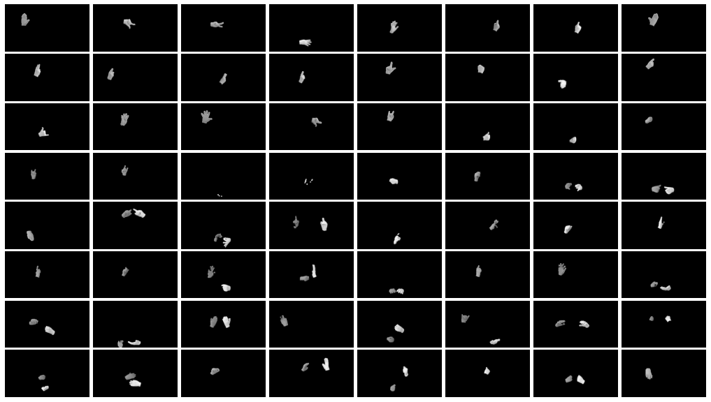
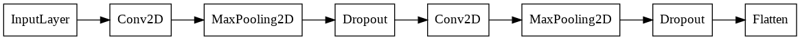
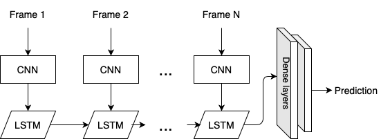
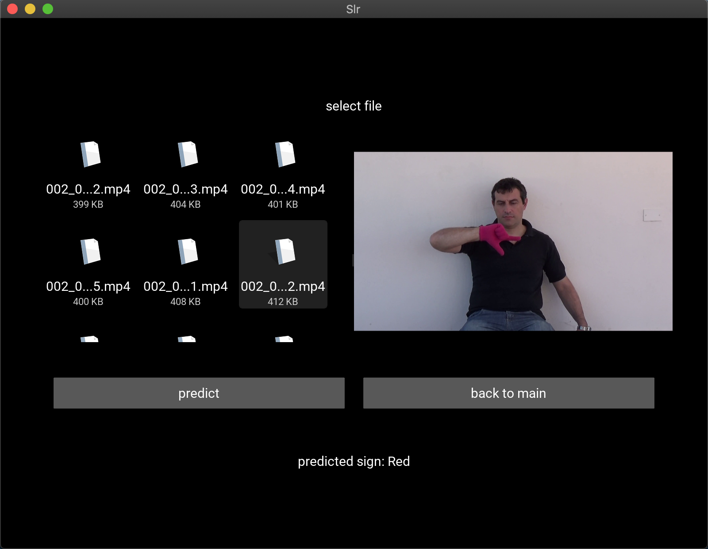
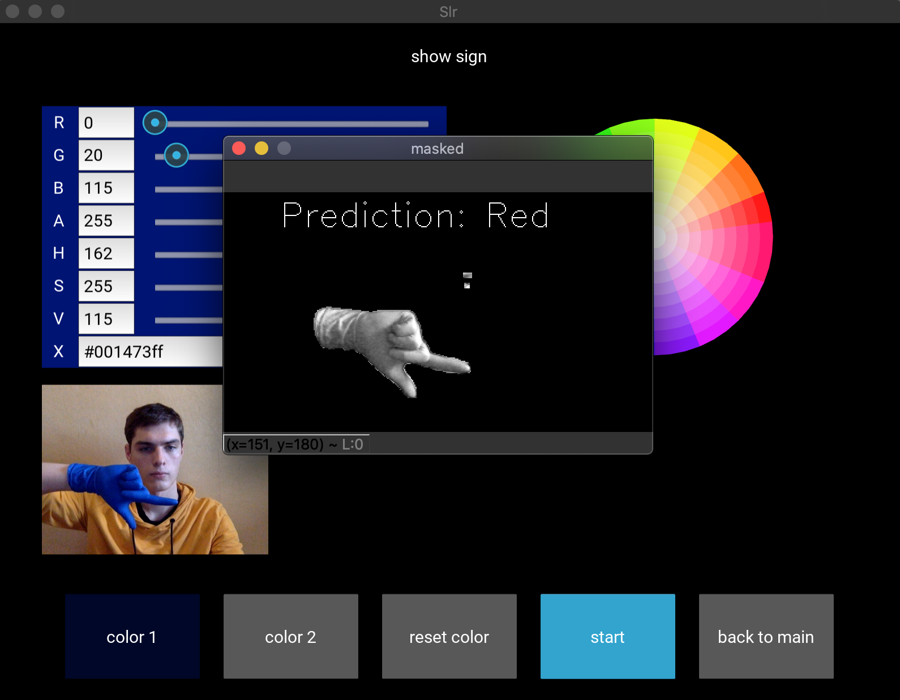
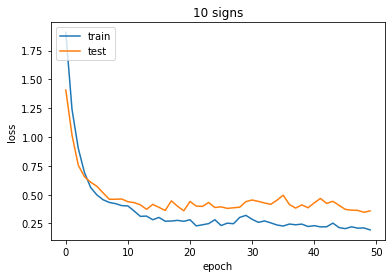
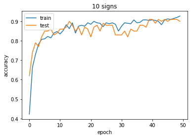
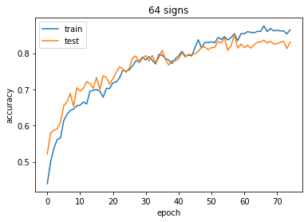

# Sign Language Recognition using deep learning
Authors: 
- Roman Polishchenko ([github link](https://github.com/roma-vinn))
- Valentyn Kofanov ([github link](https://github.com/avmepy))

# Abstract
In this work we presented visual-based system for Sign Language Recognition. Our approach uses convolutional neural networks (CNN) to analyze spatial features and recurrent neural networks (RNN) with LSTM cells to analyze temporal features of the video data. Model was trained and evaluated on Argentinean Sign Language dataset and achieved accuracy up to 90% for small part of the dataset (10 signs) and accuracy up to 83% for the whole dataset (64 signs). We also implemented a cross-platform application using Kivy Python framework to demonstrate our results. It can recognize gestures in two modes: from saved video and from camera in real time.

# Overview
## Dataset
For our work the Argentinean Sign Language ([LSA64](http://facundoq.github.io/unlp/lsa64/)) dataset was chosen. The database was recorded in two sets. The first one is in an outdoors environment, with natural lightning, while the second – in an indoors environment, with artificial lightning, to provide differences in illumination between signs.

To simplify the problem of hand segmentation within an image, subjects wore fluorescent-colored gloves. This substantially simplify the problem of recognizing the position of the hand and performing its segmentation, and remove all issues associated to skin color variations, while fully retaining the difficulty of recognizing the handshape.

Data preproccesing consists of following steps:
1. Obtain exactly 10 frames (uniformly distributed) from each video.
2. Apply masks that remove background and make it black-and-white. 
3. Combine all 10 frames into 1 training sample.

## Implementation details
For spatial features analysis we used convolutional neural network. Overall scheme is shown below. 

This single CNN is applied to each frame (time_stamp) in a sample sequentially. The implementation uses TimeDistributed layer from Keras. The outputs are passing to LSTM layer to analyze temporal dependencies. The LSTM output is passed to two Dense layers to generalize and make prediction. Categorical crossentropy is chosen as loss function and ADAM – as an optimizer.

To implement the model, we created an application (Figure 7) based on the Kivy Python framework. There are two ways to recognize signs:
- recognition for an already created video file,
- real-time recognition.

For the first way, the user needs to select an existing file and upload it. In this case, a preview of the video is available.
For real-time recognition mode, it is advisable to do a little preparation. You need to set the color(s) of the hand(s) or glove(s) to be able to distinguish it from background. User can set color for one or two hands just by succesive pressing on them on the picture. After that, the real-time recognition begins.

## Result 
Two types of tests were made: on small part of data (first 10 signs) and on the whole dataset (64 signs). For the first type, accuracy was up to 90%.

For 64 signs our first model was too small and unable to achieve accuracy higher than 55%. Obviously, it did not have enough generalization possibilities. So we made it "deeper" and it achieved higher results: up to 83%.

Our results is not as high as it could be, due to the limitations of computational power and dataset size and variability.